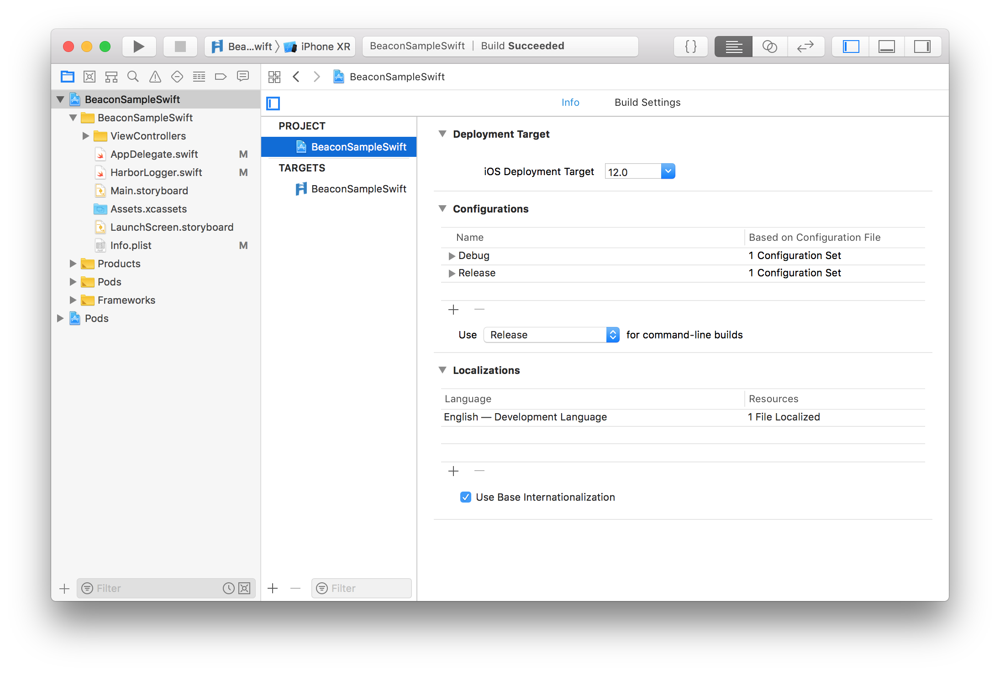
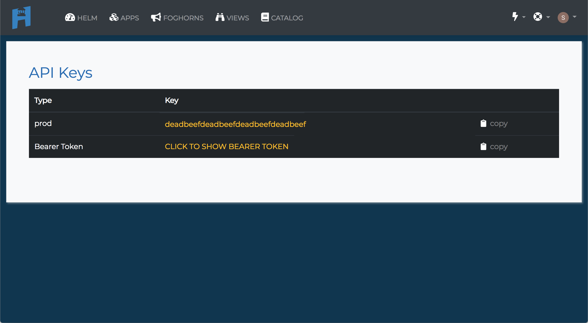
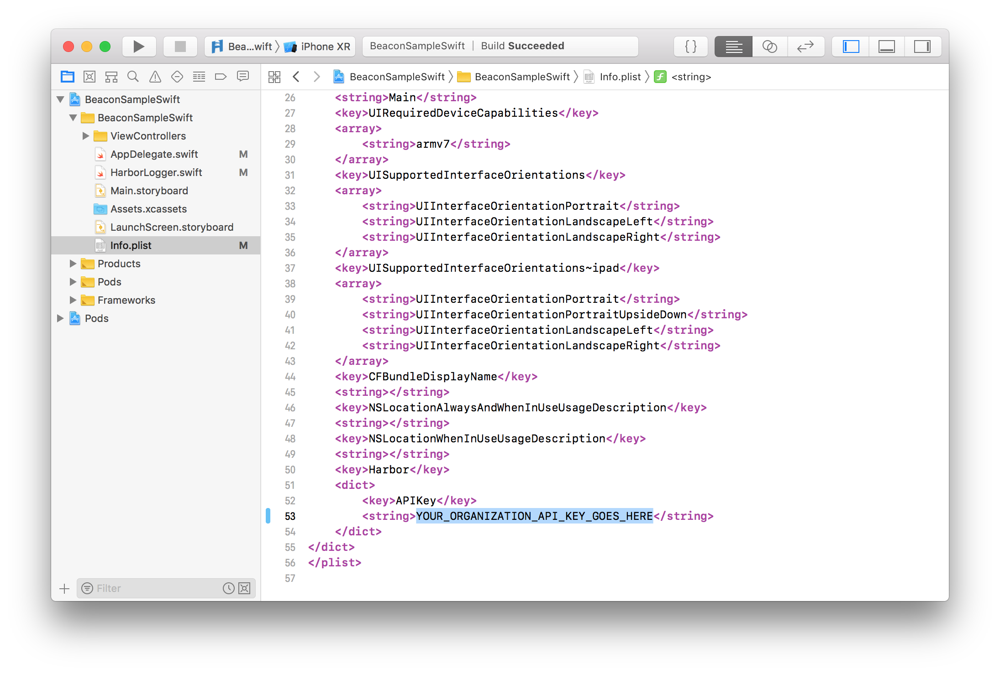
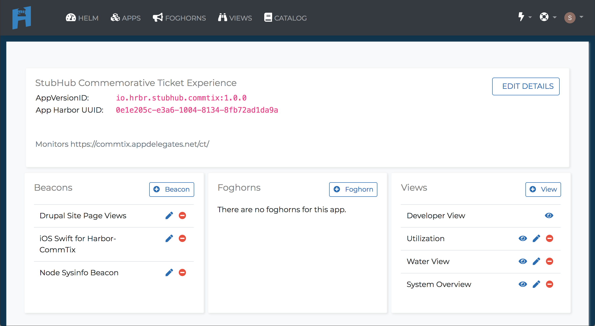
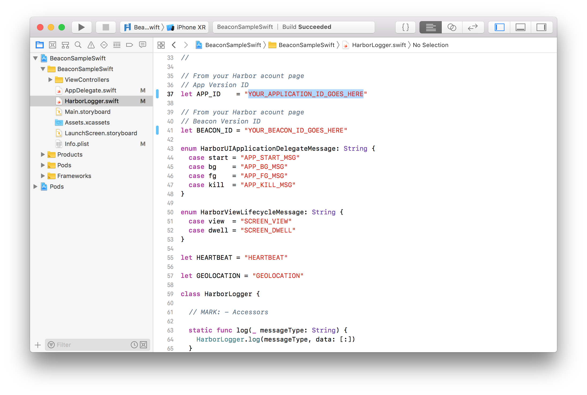
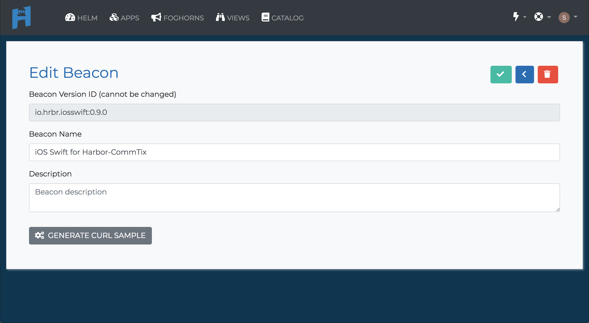
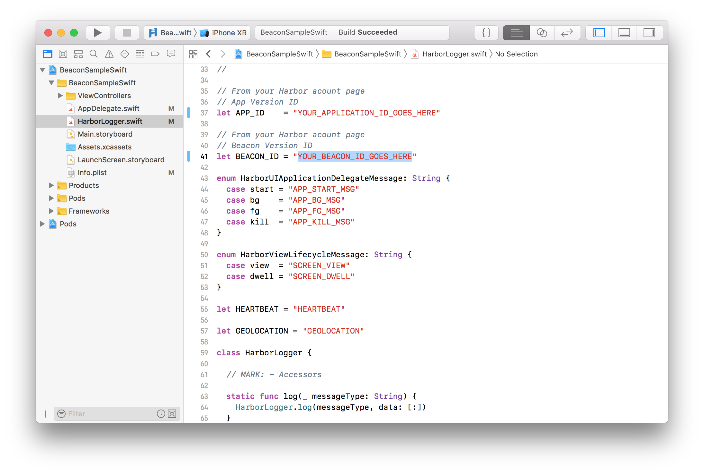
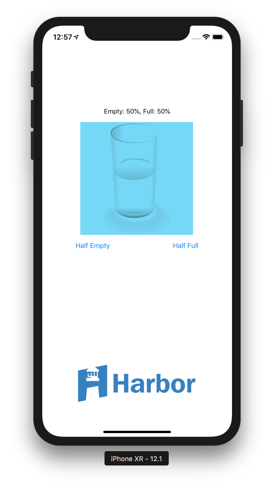
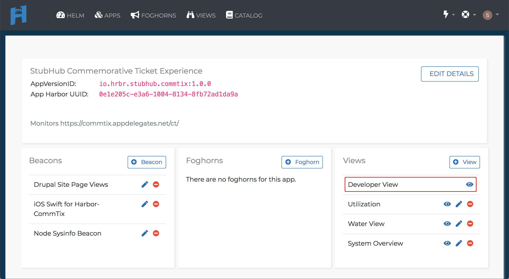

# BeaconSampleSwift

Get started with Harbor on iOS:

- [Setup](#setup) - Get setup
- [Beacon Sample](#BeaconSample) - Run the Beacon Sample app

## Setup

This project uses/requires:
 - Apple's Swift 4.2 programming language for iOS.
 - iOS Deployment Target 12.0

If you haven't used Harbor before, welcome! You can check out the [Quick Start Guide](https://docs) first.

Note: if your app uses Objective-C you are on your own.

### CocoaPods 

1. Install [CocoaPods 1.0.0+](https://guides.cocoapods.org/using/getting-started.html). 

1. Run `pod install` from the root directory of this project. CocoaPods will install `HarborBeacon.framework` and then set up an `xcworkspace`.

1. Open `BeaconSampleSwift.xcworkspace`.

## BeaconSample

### Running the Beacon Sample

To get started with the Quickstart application follow these steps:

1. Open this `BeaconSampleSwift.xcworkspace` in Xcode

2. Copy your organization API Key from the [API Keys page](https://cloud.hrbr.io/#!/account/apikeys).

3. Paste your organization API Key from the earlier step in the `Info.plist`.

4. Copy your **AppVersionID** from the specific [Applications page](https://cloud.hrbr.io/#!/apps/list).

5. Paste your **AppVersionID** in the `HarborLogger.swift`.

6. Copy your **Beacon Version ID** from the specific [Edit Beacon page](https://cloud.hrbr.io/#!/apps/list) for the Beacons for your Application.

7. Paste your **Beacon Version ID** in the `HarborLogger.swift`.

8. Run the Beacon Sample app on your iOS device or simulator.

9. Once you have your app running, you should beacons on the [Developer View page](https://cloud.hrbr.io/#!/apps/list) for your Application.!

### Beacon Messages

|Message Type|Message Data|Description|
|---|---|---|
|APP_START_MSG|N/A||
|APP_BG_MSG|N/A||
|APP_FG_MSG|N/A||
|APP_KILL_MSG|N/A||
|HEARTBEAT|N/A||
|SCREEN_VIEW|`{  "screen" : screenName } `||
|SCREEN_DWELL|`{ "screen": screenName, "time" : timeIntervalSince1970 }`||
|GEOLOCATION|`{ "latitude" : latitude, "longitude" : longitude, "altitude" : altitudeMeters, "hz_accuracy" : horizontalAccuracyMeters, "vrt_accuracy" : verticalAccuracyMeters `||

### Beacon Functions

* `HarborLogger.appStart()`
* `HarborLogger.appBackground()`
* `HarborLogger.appForeground()`
* `HarborLogger.appKill()`
* `HarborLogger.startHeartbeat(beatsPerMinute : Int)`
* `HarborLogger.stopHeartbeat()`
* `HarborLogger.logLocation(location : : CLLocation)`
* `HarborLogger.startScreenDwell(viewName : String)`
* `HarborLogger.stopScreenDwell(viewName : String)`

## License

This project is licensed under the [Apache License, Version 2.0](https://github.com/HrbrIO/BeaconSampleSwift/blob/master/LICENSE)
