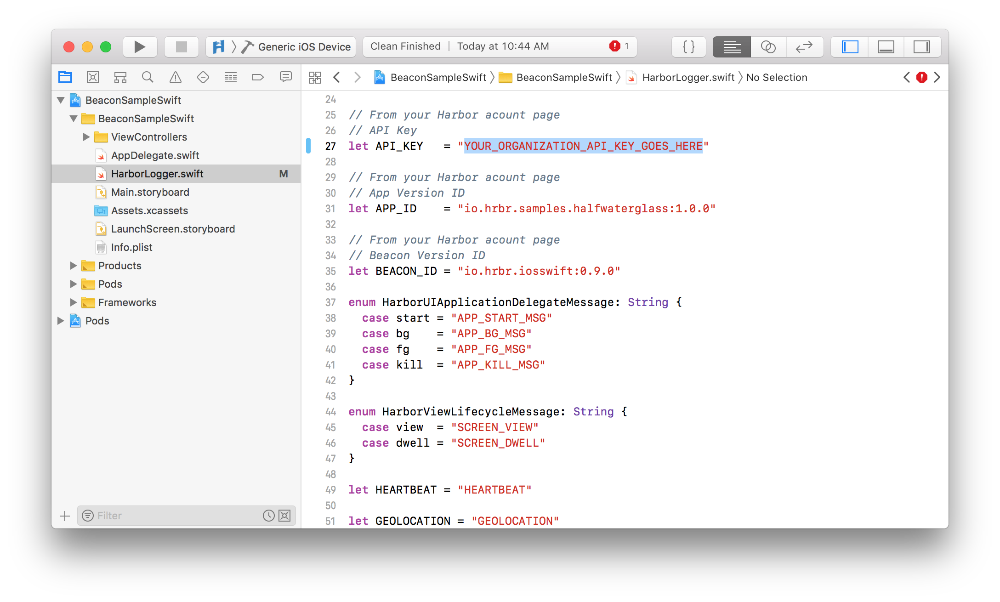

# BeaconSampleSwift
Sample iOS Swift application to send Harbor Beacons.

## Deployment

Add your organization API Key to the  [BeaconSampleSwift/Info.plist](BeaconSampleSwift/Info.plist) file in your Xcode Project

```
<key>Harbor</key>
<dict>
<key>APIKey</key>
<string>YOUR_ORGANIZATION API_KEY_GOES_HERE</string>
</dict>
```

Set the APP_ID and BEACON_ID in [BeaconSampleSwift/HarborLogger.swift](BeaconSampleSwift/HarborLogger.swift)

```
// From your Harbor acount page
// App Version ID
let APP_ID    = "io.hrbr.samples.halfwaterglass:1.0.0"

// Beacon Version ID
let BEACON_ID = "io.hrbr.iosswift:0.9.0"
```

---

# BeaconSampleSwift

Get started with Harbor on iOS:

- [Setup](#setup) - Get setup
- [Beacon Sample](#BeaconSample) - Run the Beacon Sample app

## Setup

This project uses Apple's Swift 4.2 programming language for iOS. 

If you haven't used Harbor before, welcome! You'll need to [Sign up for a Harbor account](https://www.hrbr.io/try-hrbr) first.

Note: if your app uses Objective-C you are on your own.

### CocoaPods 

1. Install [CocoaPods 1.0.0+](https://guides.cocoapods.org/using/getting-started.html). 

1. Run `pod install` from the root directory of this project. CocoaPods will install `HarborBeacon.framework` and then set up an `xcworkspace`.

1. Open `BeaconSampleSwift.xcworkspace`.

## BeaconSample

### Running the Beacon Sample

To get started with the Quickstart application follow these steps:

1. Open this `BeaconSampleSwift.xcworkspace` in Xcode


2. Copy your organization API Key from the [API Keys page](https://cloud.hrbr.io/#!/account/apikeys).


3. Paste your organization API Key from the earlier step in the `Info.plist`.



4. Copy your **AppVersionID** from the specific [Applications page](https://cloud.hrbr.io/#!/apps/list).


5. Paste your **AppVersionID** in the `HarborLogger.swift`.


6. Copy your **Beacon Version ID** from the specific [Edit Beacon page](https://cloud.hrbr.io/#!/apps/list) for the Beacons for your Application.


7. Paste your **Beacon Version ID** in the `HarborLogger.swift`.


8. Run the Beacon Sample app on your iOS device or simulator.


9. Once you have your app running, you should beacons on the [Developer View page](https://cloud.hrbr.io/#!/apps/list) for your Application.!


What needs installed on system.

Links for how-to’s for people who don’t know how to.

## Installation
E.g. If you don’t know you to register your beacon version ID check out this guide. https://docs.hrbr.io/quick-start-guide/#registering-the-beacon.


## Configuration Options

Optional - Build Instructions (Post installation Configuration Instructions)
Beacon Message Format
Or 
Beacon Functions

Beacon Run and Schedule
How to check to see if you beacon is working.

## License

This project is licensed under the [Apache License, Version 2.0](https://github.com/HrbrIO/BeaconSampleSwift/blob/master/LICENSE)
